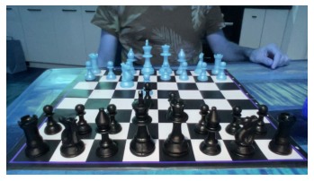
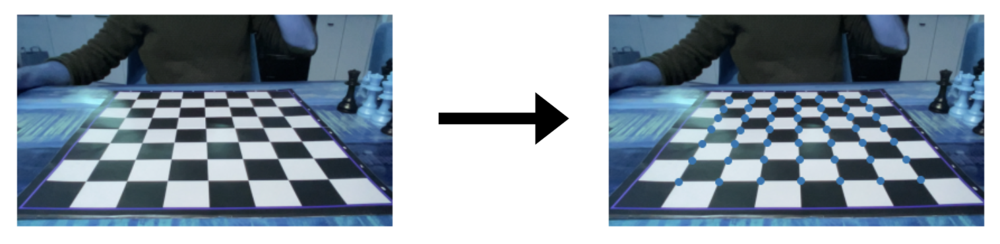
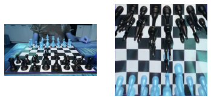
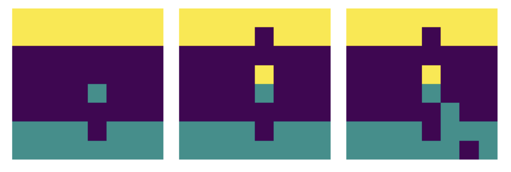

# Cam chess (IN PROGRESS)

Play chess against your laptop using real chess set.


This is a mini-project that could be used to teach AI. Final goal will be an engine which allows you to play real chess board against a laptop. Most interesting part is to estimate what move you have made using NN. What you will have to do is to show some preset chess board to the engine so that it can retrain the model. After that you should be able to play as if you have a smart chess board. It's a fun mini-project for a cold winter evening.

## Simplifying the problem

First of all our cam output is quite complex and will contain a lot of occlusions making it not so trivial.



If you think about the problem carefully we can simplify it a lot by having a predictive model that returns three outputs for each square - empty, white or black. This is sufficient to track the game since we know the board state and game rules. Exact piece identification would be much more complex problem and likely would need better cam placement. Instead let's use this simplified problem.

## First step - identifying board corners

For corner identification CV2 checker board detection is sufficient.



You will need to calibrate the board each time you move it (even slightly) by executing:

```python
empty = capture()
corners = detect_checkerboard(empty)
```

## Second step - adjust perspective and chop

Based on detected corners it's easy to adjust perspective and then chop the board into squares. Each square will be 100px by 100px and will include colored output.



This pipeline is implemented in - `capture_pipeline(corners)`.

## Third step - label some data and train a model

For training data I simply used random position generator and single capture produced 64 images. 32 of those are empty, 16 are white and 16 are black. To calibrate the dataset white and black captures are augmented by including their mirror images, thus producing a total of 96 data points from a single capture. It turns out that ~20 random board are enough to get decent results.

To generate random board execute:

```python
board = random_board()
board
```

Then arrange the pieces and run:

```python
save_train_data(capture_pipeline(corners), is_filled(board))
```

For model I simply took pretrained mobilenet and added couple fully connected layers (training is located in *notebooks/5.2. Three class model.ipynb*). Generalization is quite decent and simple dropout helped to prevent overfitting. Remember that model has 3 outputs - empty, white or black. It achieved >90% overall accuracy, but as it turns out this is sufficient since in the next step we will limit number of relevant squares based on game state.



## Fourth step - let's play a game

For the game engine I decided to go with [python-chess](https://python-chess.readthedocs.io/en/latest/). Move estimation strategy is quite simple - first I extract possible moves at the current board state, then I look at NN probabilities for the given collor. Since I expect that the figure will move from one square to another our final estimate is simply a difference of presence between new field and current one.

Game can be played by using keras model and python-chess as follows:

```python
# Set up empty board
board = chess.Board()
# Captures current state
fields = capture_pipeline(corners)
# Extracts probs from the model given current player
probs = {k: v[1 if board.turn else 2] for k, v in predict(model, fields, True).items()}
# Checks for legal moves
legal_moves = [(str(m)[:2], str(m)[2:]) for m in board.legal_moves]
# Combines probs - you should move from field a to field b
probs_combo = [probs[b] - probs[a] for a, b in legal_moves]
# Selects most likely move
move = list(board.legal_moves)[np.argmax(probs_combo)]
```

From there it's quite easy to connect it with any chess engine or online chess engine and have a nice game. In demo video I have used [Stockfish](https://stockfishchess.org/download/).

# TODO

There is a bunch of things that I still need to do:
- Implement video stream processor that detects move before passing it to processing
- Clean up notebooks
- Move chess engine support into code
- Add docstrings
- Move tests from notebooks to test cases
- Create a single notebook that explains all process
- etc.
